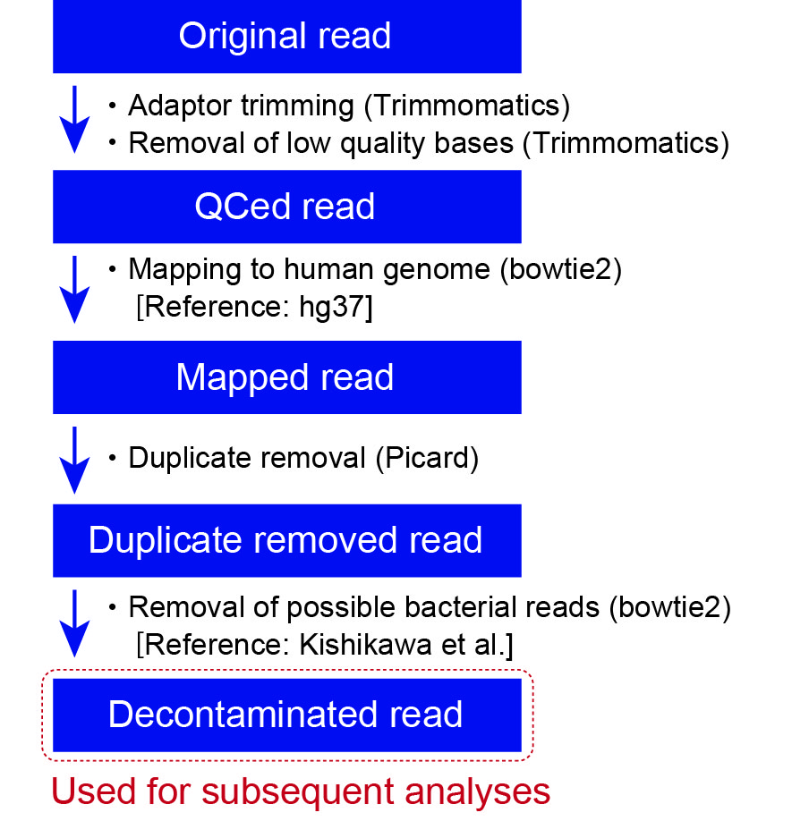
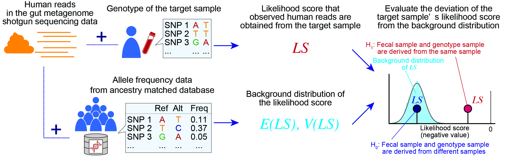
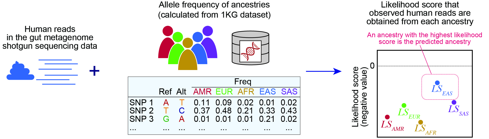

# Analysis of the human reads in gut metagenome shotgun sequencing data
This is a repository of the codes used in the Tomofuji et al (Reconstruction of the personal information from the contaminated human reads in the gut metagenome shotgun sequencing data).  
Our software recovers following information from the human reads in the metagenome shotgun sequencing data  
・Genetic sex of the metagenome shotgun sequencing data
・Pair of the metagenome shotgun sequencing data and genotype data derived from the same individual
・Genetic ancestry of the metagenome shotgun sequencing data

# Overview


# Requirements
```
bowtie2  
samtools  
bedtools  
bcftools  
fastqc  
```

# 1. Extraction of the human reads + prediction of genetic sex
<div align="center">

</div>

First, human reads are extracted from gut metagenome shotgun sequencing data with the script `PIPELINE_1_human_read_extraction.sh`. 
Following variables are required

`TRIM_ADAPT`: adaptor-sequence (ex: TruSeq3-PE-2.fa)  
`BOWTIE2_REF_HUM`: reference file for bowtie2 (human, ex: hg37_1kg_decoy)  
`BOWTIE2_REF_BAC`: reference file for bowtie2 (bacteria)  
`DIR`: Directory for analysis  
`FASTQ_DIR`: Directory of original fastq file  
`ID`: Sample ID   
`BED_OF_NONPAR`: bed file for non-pseudoautosomal region (non-PAR) of the X and Y chromosomes  

This script outputs human reads in the metagenome shotgun sequencing data (`non_bacterial_${ID}_mapped.bam`) which can be used in the subsequent analyses.
In addition, coverages of the non-PAR of X and Y chromosomes are output into `bedcov_${ID}_nonPAR_XY.txt`, which can be used to predict genetic sex of the metagenome shotgun sequencing data.

# 2. Re-identification from a set of genotype data
<div align="center">

</div>

Likelihood scores for each metagenome shotgun sequencing data could be calculated with the script `PIPELINE_2_likelihood_reidentification_test.sh`. The likelihood score reflected the likelihood that the observed human reads in the gut MSS data were derived from the target genotype data in `GENOME_FILE`.
Following variables are required

`VCF_NAME`: Name of the vcf file added to the output filename
`GENOME_FILE`: Vcf file for genotype dataset for which the likelihood score is calculated  
`REF_FASTA`: reference genome file (ex: hg37_1kg_decoy)  
`DIR`: Directory for analysis  
`REFERENCE_PANEL`: Vcf file for reference genotype data  
`REF_PLINK`: Plink file for reference genotype data  
`ID`: Sample ID   

This script outputs likelihood score for each pair of the metagenome shotgun sequencing data and target genotype data.
The column of the `${ID}_likelihood_p_val_result.txt` indicates following values

`ID`: Sample ID of the target genotype data   
`Score`: Lilelihood score  
`EMP_P`: Empilically caluclated P-values   
`ANA_p`: P-values analytically calculated from the standardized likelihood score  
`RANK`: Rank of the likelihood score among the genotype dataset  
`ID_MATCH`: Whether the ID of the metagenome shotgun sequencing data is matched to that of the target genotype data  

# 3. Prediction of the ancestry
<div align="center">

</div>

